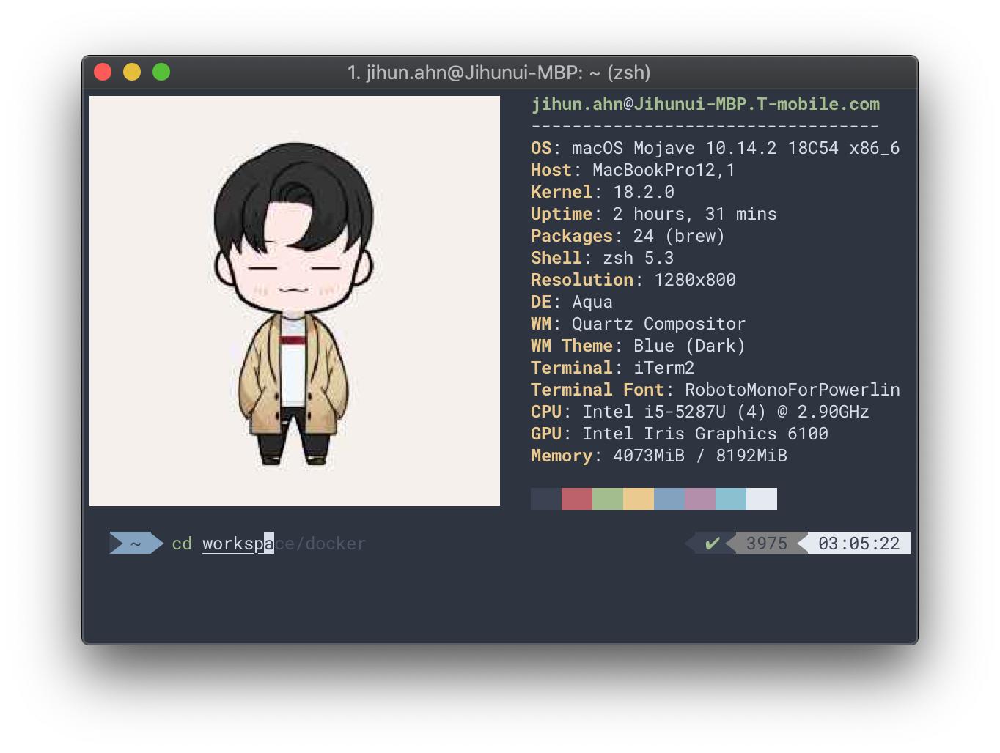

# Set bash profile or managing zsh configuration.

You run a macos machine at first time, there is no default profile.
So, you should be register the profile for initial configuration.



---

## How to use

```bash
$ make install
$ make uninstall
```
To configure with the bash-profile ($SHELL=/bin/bash), enter the below as:

```bash
$ make install MODE=bash
$ make uninstall MODE=bash
```

## neofetch
[neofetch](https://github.com/dylanaraps/neofetch#) is displays information about your operating system, software and hardware in an aesthetic and visually pleasing way.

## oh-my-zsh
[oh-my-zsh](https://ohmyz.sh) is a delightful, managing zsh configuration. It comes bundled with a ton of helpful functions, helpers, plugins, themes, and a few things that make you shout...

### Plugins
- [zsh-syntax-highlighting](https://github.com/zsh-users/zsh-syntax-highlighting#zsh-syntax-highlighting): It enables highlighting of commands whilst they are typed at a zsh prompt into an interactive terminal.
- [zsh-autosuggestions](https://github.com/zsh-users/zsh-autosuggestions): It suggests commands as you type, based on command history.
- [zsh-completions](https://github.com/zsh-users/zsh-completions): Additional completion definitions for Zsh.

### themes
- [powerlevel9k](https://github.com/bhilburn/powerlevel9k): The most awesome Powerline theme for ZSH around!

### Fonts
- [powerline](https://github.com/powerline/fonts): Patched fonts for Powerline users.
