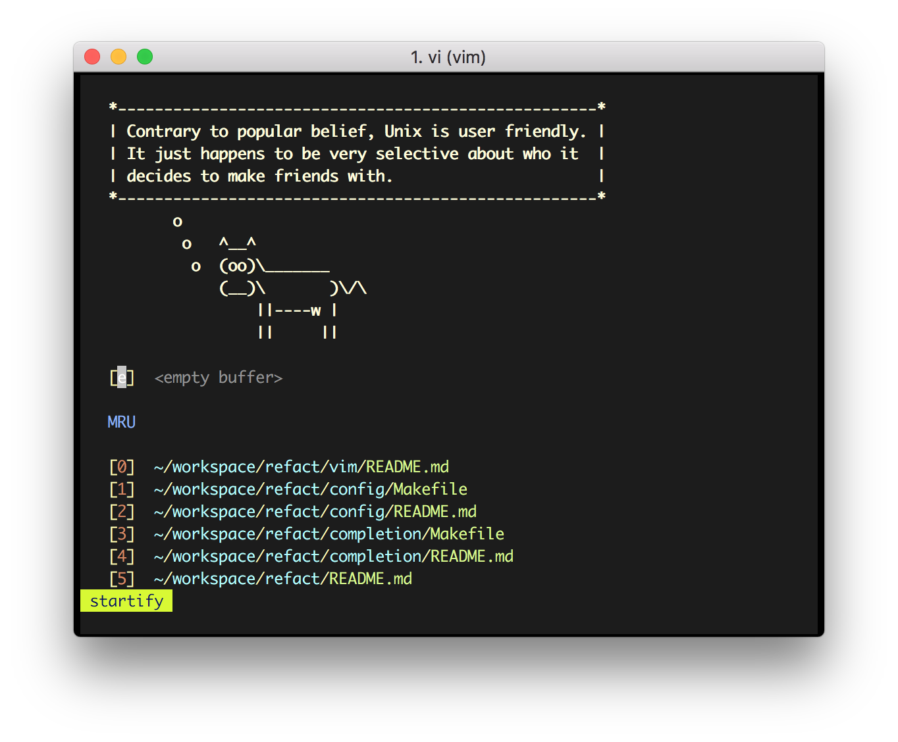

# Set .vimrc with Vim plugin manager.

When running the vi command, It is useful to install plugins including [vundle](http://github.com/VundleVim/Vundle.Vim).



---

## Plugins
- [taglist.vim](http://vim-taglist.sourceforge.net): It provides an overview of the structure of source code files and allows you to efficiently browse through source code files in different programming language.
- [Trinity](https://github.com/wesleyche/Trinity#trinity): manages Source Explorer, Taglist and NERD Tree, and build them as a great IDE.
- [tpope/vim-fugitive](https://github.com/tpope/vim-fugitive#fugitivevim): View any blob, tree, commit, or tag in the repository
- [vim-airline/vim-airline](https://github.com/vim-airline/vim-airline#vim-airline-): Allows statusline consists of several sections, each one displaying some piece of information.
- [airblade/vim-gitgutter](https://github.com/airblade/vim-gitgutter#vim-gitgutter): A Vim plugin which shows a git diff in the 'gutter'
- [mhinz/vim-startify](https://github.com/mhinz/vim-startify): This plugin provides a start screen for Vim and Neovim.
- [pangloss/vim-javascript](https://github.com/pangloss/vim-javascript#vim-javascript): Vastly improved Javascript indentation and syntax support in Vim.
- [node.js]
- [godlygeek/tabular](https://github.com/godlygeek/tabular#tabular): Vim script for text filtering and alignment
- [plasticboy/vim-markdown](https://github.com/plasticboy/vim-markdown#vim-markdown): Markdown Vim Mode
- [wombat256.vim](https://www.vim.org/scripts/script.php?script_id=2465): color scheme

## How to use
To configure with the default settings, enter the below as:

```bash
$ make install
$ make uninstall
```
